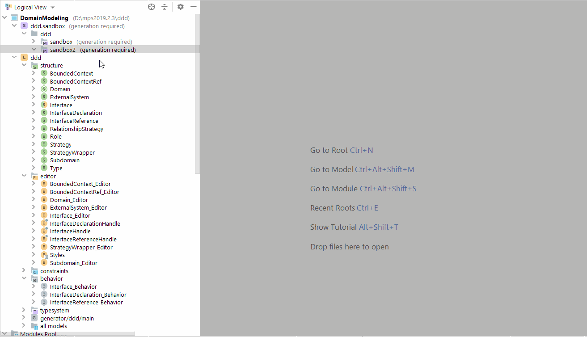
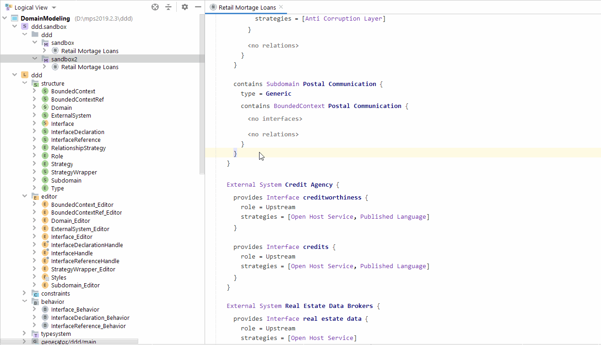
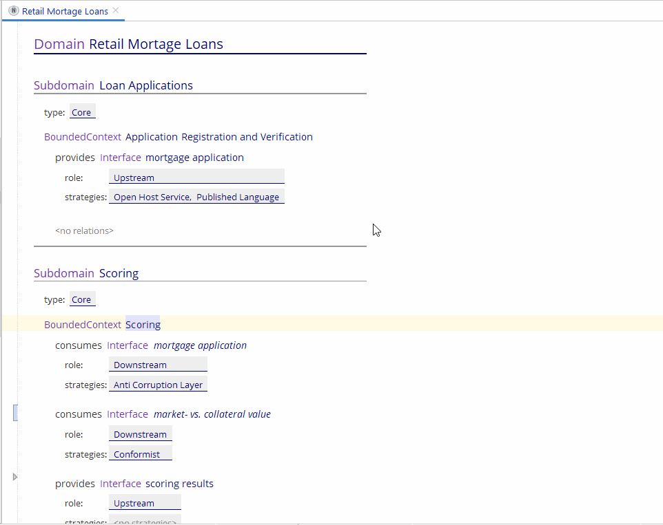

This is just a quick demo of the [code-your-model language](https://github.com/innoq/code-your-model) implemented with [JetBrains MPS](https://www.jetbrains.com/mps/), version 2019.2.3. This project uses [MPS-extensions](https://github.com/JetBrains/MPS-extensions).

In this first iteration, I just followed the syntax of the original, internal groovy DSL. Naturally, one could now add alternative notations, including graphical ones and even one that looks more like a document than code.
Further below an alternative editor with mainly different styling is shown.

Anyway, here are some GIFs to get a feeling for what the standard editors looks like and how it "feels":

Actual ReadMe: TODO!
